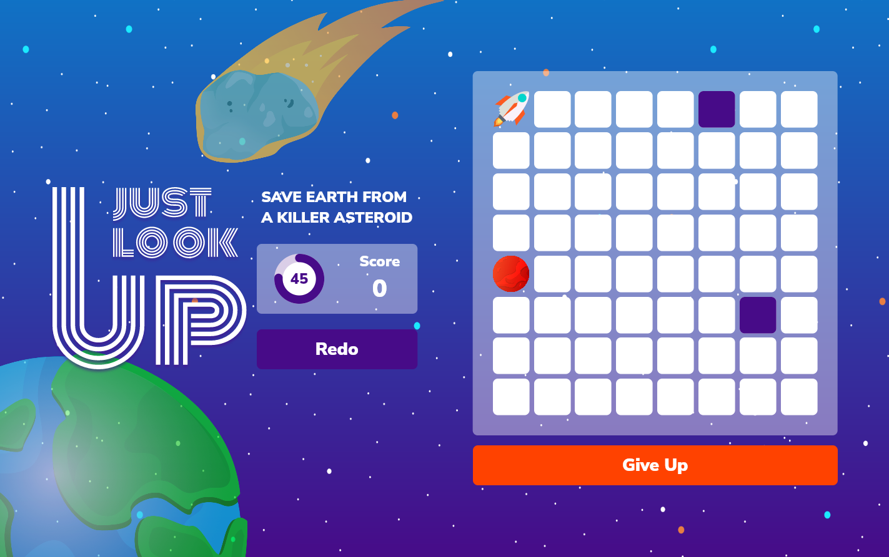

# Just Look Up
Just Look Up is [Flutter Puzzle Hack](https://flutterhack.devpost.com/?ref_feature=challenge&ref_medium=your-open-hackathons&ref_content=Submissions+open) Submission

by Tomohiko Tanihata (development) and Nobuhiro Sato (design)

## Concept 
A huge meteorite is heading for Earth. Shoot the rocket into the meteorite and destroy it to save the earth. 

## How to play
There is a rocket and a meteorite in an 8x8 grid. 
By manipulating the rocket and hitting the meteorite, it will explode.
Once you explode a meteorite, another meteorite will be generated. 
The game is to repeat this process and shoot many rockets. 

The player can control the rocket by flicking the screen or typing arrows on the keyboard. The rocket will not stop until it hits a wall or obstacle. To hit a meteorite it is not enough to pass by, you have to stop just there.

Pressing the Start button will start a time trial to see how many meteorites you can shoot down in one minute. 

## Preview

## Inspirations 
- The concept came from [Don't Look Up](https://www.netflix.com/jp-en/title/81252357). 
- The puzzle idea is inspired by [Pokémon Gold and Silver / Ice Path](https://strategywiki.org/wiki/Pok%C3%A9mon_Gold_and_Silver/Ice_Path). This is the first Sliding puzzle in my life. 
- In the implementation, I referred to [Sample Project](https://github.com/VGVentures/slide_puzzle) by [Very Good Ventures](https://verygood.ventures/). 

## Dependancies
- [equatable](https://pub.dev/packages/equatable)
- [bloc](https://pub.dev/packages/bloc)
- [flutter_bloc](https://pub.dev/packages/flutter_bloc)
- [hexcolor](https://pub.dev/packages/hexcolor)
- [isolated_worker](https://pub.dev/packages/isolated_worker)
- [confetti](https://pub.dev/packages/confetti)
- [flutter_svg](https://pub.dev/packages/flutter_svg)
- [simple_shadow](https://pub.dev/packages/flutter_svg)